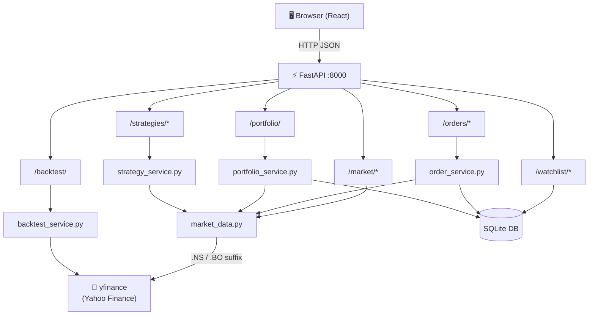

# AlgoPlatform – Architecture & File-by-File Guide
> **Written for backend developers.** This document explains how every part of the system works, how data flows, how trading happens, and what every single file does.

---

## Table of Contents
1. [What this platform does](#1-what-this-platform-does)
2. [System Architecture (diagram)](#2-system-architecture)
3. [Project Structure](#3-project-structure)
4. [Backend – File by File](#4-backend--file-by-file)
   - [Entry Point](#41-appmainpy--entry-point)
   - [Core Layer](#42-appcore--configuration--database)
   - [Data Models](#43-appmodels--orm--schemas)
   - [Services Layer](#44-appservices--business-logic)
   - [API Layer](#45-appapi--route-handlers)
   - [Tests](#46-tests)
5. [Frontend – File by File (backend dev view)](#5-frontend--file-by-file-backend-dev-view)
6. [How Trading Works End-to-End](#6-how-trading-works-end-to-end)
7. [Database Schema](#7-database-schema)
8. [How Strategies & Signals Work](#8-how-strategies--signals-work)
9. [How Backtesting Works](#9-how-backtesting-works)
10. [Configuration & Environment Variables](#10-configuration--environment-variables)

---

## 1. What This Platform Does

AlgoPlatform is a **paper-trading** algorithmic trading platform for the Indian Stock Exchange (NSE and BSE).

> **Paper trading = no real money.** You start with virtual ₹10 Lakh. All orders are simulated at real market prices fetched live from Yahoo Finance.

**Core capabilities:**

| Capability | What it does |
|---|---|
| Live market data | Fetches real-time quotes and OHLCV history for any NSE/BSE stock |
| Paper orders | BUY/SELL with virtual money, respects margin (no shorting without holding) |
| Portfolio tracking | Tracks open positions, avg buy price, unrealised P&L, realised P&L |
| Watchlist | Saves a personal list of symbols, always shown with live quotes |
| Strategy signals | Runs MA-Crossover / RSI / MACD over live data → BUY/SELL/HOLD |
| Backtesting | Replays a strategy over historical OHLCV data, computes Sharpe, drawdown, win rate |

---

## 2. System Architecture

```
┌──────────────────────────────────────────────────────────────────┐
│                        USER'S BROWSER                            │
│              React + Vite SPA  (localhost:5173)                  │
│  Dashboard │ Portfolio │ Orders │ Strategies │ Backtest           │
└──────────────────────────┬───────────────────────────────────────┘
                           │  HTTP/JSON (Axios)
                           │  Vite dev-proxy → localhost:8000
                           ▼
┌──────────────────────────────────────────────────────────────────┐
│               FastAPI Backend  (localhost:8000)                  │
│                                                                  │
│  ┌────────────┐  ┌──────────┐  ┌───────────┐  ┌─────────────┐  │
│  │ /market    │  │ /orders  │  │/strategies│  │ /backtest   │  │
│  │ /watchlist │  │/portfolio│  │           │  │             │  │
│  └──────┬─────┘  └────┬─────┘  └─────┬─────┘  └──────┬──────┘  │
│         │             │              │               │          │
│  ┌──────▼─────────────▼──────────────▼───────────────▼──────┐   │
│  │                   Services Layer                          │   │
│  │  market_data · order_service · portfolio_service          │   │
│  │  strategy_service · backtest_service                      │   │
│  └──────────────┬──────────────────────────┬────────────────┘   │
│                 │                          │                     │
│         ┌───────▼──────┐         ┌─────────▼──────┐             │
│         │  yfinance    │         │  SQLite DB      │             │
│         │  (Yahoo Fin.)│         │  (algoplatform  │             │
│         │  NSE .NS     │         │   .db)          │             │
│         │  BSE .BO     │         │  orders         │             │
│         └──────────────┘         │  positions      │             │
│                                  │  portfolio      │             │
│                                  │  watchlist      │             │
│                                  └─────────────────┘             │
└──────────────────────────────────────────────────────────────────┘
```

### Data Flow Diagram (Mermaid)



---

## 3. Project Structure

```
algoPlatform/
│
├── README.md                       ← Quick-start guide
├── ARCHITECTURE.md                 ← This file
├── docs/
│   ├── TRADING_GUIDE.md            ← How to trade step by step (with curl)
│   ├── API_REFERENCE.md            ← Full request/response examples
│   └── SCREENSHOTS.md              ← Annotated UI screenshots
│
├── backend/                        ← Python FastAPI application
│   ├── requirements.txt            ← All pip dependencies
│   ├── pytest.ini                  ← Test configuration
│   ├── app/
│   │   ├── main.py                 ← App factory, middleware, router registration
│   │   ├── core/
│   │   │   ├── config.py           ← Settings (pydantic-settings + .env)
│   │   │   └── database.py         ← SQLAlchemy async engine + session factory
│   │   ├── models/
│   │   │   ├── db_models.py        ← SQLAlchemy ORM tables
│   │   │   └── schemas.py          ← Pydantic request/response schemas
│   │   ├── services/
│   │   │   ├── market_data.py      ← yfinance wrapper (quotes + history)
│   │   │   ├── order_service.py    ← Paper trading engine
│   │   │   ├── portfolio_service.py← P&L computation
│   │   │   ├── strategy_service.py ← MA / RSI / MACD signal generation
│   │   │   └── backtest_service.py ← Historical strategy simulation
│   │   └── api/
│   │       ├── market_data.py      ← GET /market/*
│   │       ├── orders.py           ← POST/GET/DELETE /orders/*
│   │       ├── portfolio.py        ← GET /portfolio/
│   │       ├── strategies.py       ← GET /strategies/*
│   │       ├── watchlist.py        ← GET/POST/DELETE /watchlist/*
│   │       └── backtest.py         ← POST /backtest/
│   └── tests/
│       ├── conftest.py             ← pytest markers
│       └── test_api.py             ← 11 end-to-end + unit tests
│
└── frontend/                       ← React 18 + Vite SPA
    ├── vite.config.js              ← Dev proxy config (→ :8000)
    ├── tailwind.config.js          ← Tailwind CSS config
    └── src/
        ├── main.jsx                ← React app mount point
        ├── App.jsx                 ← Root component + toast provider
        ├── index.css               ← Tailwind base styles
        ├── api/
        │   └── index.js            ← All API calls in one place (Axios)
        ├── components/
        │   ├── StockCard.jsx       ← Single stock price tile
        │   ├── PriceChart.jsx      ← Area chart (Recharts)
        │   ├── OrderPanel.jsx      ← BUY/SELL order form
        │   ├── OrderBook.jsx       ← Trade history table
        │   ├── PortfolioView.jsx   ← Holdings + P&L table
        │   ├── Watchlist.jsx       ← Add/remove/view watchlist
        │   ├── StrategySignal.jsx  ← Signal display (BUY/SELL/HOLD)
        │   └── BacktestPanel.jsx   ← Backtest form + results
        └── pages/
            └── Dashboard.jsx       ← Tab router + layout
```

---

## 4. Backend – File by File

### 4.1 `app/main.py` – Entry Point

```python
# What it does:
# 1. Creates the FastAPI app instance
# 2. Registers CORS middleware (allows requests from any origin)
# 3. Calls init_db() on startup (creates tables if missing)
# 4. Mounts all 6 routers under their prefixes
# 5. Exposes GET / health check
```

**Key concept – `lifespan`:**  
FastAPI's `lifespan` is the modern replacement for `@app.on_event("startup")`. The code inside runs before the app starts accepting requests.

```python
@asynccontextmanager
async def lifespan(app: FastAPI):
    await init_db()   # ← runs at startup
    yield             # ← app serves requests here
```

**CORS:**  
Currently set to `allow_origins=["*"]` which is fine for development. For production, change to your frontend domain.

---

### 4.2 `app/core/` – Configuration & Database

#### `app/core/config.py`

```python
class Settings(BaseSettings):
    app_name: str = "AlgoPlatform - Indian Stock Exchange"
    database_url: str = "sqlite+aiosqlite:///./algoplatform.db"
    initial_capital: float = 1_000_000.0   # ₹10 Lakh
```

- Uses **pydantic-settings** — all fields can be overridden via environment variables or a `.env` file.
- `database_url` uses the `sqlite+aiosqlite://` scheme — the `aiosqlite` driver makes SQLite work with Python's `asyncio`.
- `initial_capital` is the starting virtual cash — change it in `.env` if you want more/less.

**Override example:**
```bash
# .env
DATABASE_URL=sqlite+aiosqlite:///./mydb.db
INITIAL_CAPITAL=500000
```

#### `app/core/database.py`

```
┌─────────────────────────────────────────────────────────┐
│  create_async_engine(database_url)                      │
│        │                                                │
│        ▼                                                │
│  async_sessionmaker  ←── used by Depends(get_db)       │
│        │                                                │
│        ▼                                                │
│  AsyncSession  ←── injected into every route handler   │
└─────────────────────────────────────────────────────────┘
```

- `engine` — the connection pool to the SQLite file.
- `AsyncSessionLocal` — a factory that produces `AsyncSession` objects.
- `get_db()` — a FastAPI **dependency** (used via `Depends(get_db)` in routes). It opens a session, yields it to the route handler, and automatically closes it afterward.
- `init_db()` — called once on startup; runs `CREATE TABLE IF NOT EXISTS` for every ORM model.

---

### 4.3 `app/models/` – ORM & Schemas

#### `app/models/db_models.py` – Database Tables

Four tables are defined using SQLAlchemy's **mapped_column** (the modern 2.0 API):

```
┌──────────────────────────────────────────────────────────────────┐
│  TABLE: orders                                                   │
│  id | symbol | exchange | side | order_type | quantity | price  │
│     | executed_price | status | strategy | created_at | ...     │
├──────────────────────────────────────────────────────────────────┤
│  TABLE: positions   (one row per stock you hold)                 │
│  id | symbol | exchange | quantity | avg_buy_price | realised_pnl│
├──────────────────────────────────────────────────────────────────┤
│  TABLE: portfolio   (always exactly 1 row, id=1)                 │
│  id | cash | initial_capital | updated_at                       │
├──────────────────────────────────────────────────────────────────┤
│  TABLE: watchlist                                                │
│  id | symbol | exchange | added_at                              │
└──────────────────────────────────────────────────────────────────┘
```

**Important design decisions:**
- `portfolio` is a single-row table (id=1 always). It stores available cash.
- `positions` has `UNIQUE(symbol)` — one row per stock. `avg_buy_price` is recalculated using the [weighted average cost](https://en.wikipedia.org/wiki/Average_cost_method) formula on every BUY.
- Orders are **never deleted** — they are a full audit trail of all trades.
- Enums (`OrderSide`, `OrderStatus`, `OrderType`) are stored as strings in the DB.

#### `app/models/schemas.py` – Pydantic Schemas

These are the **API contract** — what comes in and what goes out.

```
Request schemas (used for validation of incoming JSON):
  OrderCreate        ← POST /orders/
  WatchlistAdd       ← POST /watchlist/
  BacktestRequest    ← POST /backtest/

Response schemas (serialise ORM objects → JSON):
  QuoteResponse      ← GET /market/quote/{symbol}
  HistoricalResponse ← GET /market/historical/{symbol}
  OrderResponse      ← all /orders/ endpoints
  PortfolioSummary   ← GET /portfolio/
  PositionResponse   ← embedded in PortfolioSummary
  WatchlistItem      ← all /watchlist/ endpoints
  StrategySignal     ← GET /strategies/signal/{symbol}
  BacktestResult     ← POST /backtest/
  BacktestTrade      ← embedded in BacktestResult
  OHLCBar            ← embedded in HistoricalResponse
```

The `model_config = {"from_attributes": True}` on response schemas enables FastAPI to build the Pydantic model directly from a SQLAlchemy ORM object (no manual `.to_dict()` needed).

---

### 4.4 `app/services/` – Business Logic

#### `app/services/market_data.py`

**Purpose:** The only file that talks to Yahoo Finance.

```
_yf_symbol("RELIANCE", "NSE")  →  "RELIANCE.NS"
_yf_symbol("TCS",      "BSE")  →  "TCS.BO"
```

`get_quote(symbol, exchange)`:
1. Calls `yf.Ticker(symbol).fast_info` — fast, doesn't download full info
2. Falls back to `yf.Ticker(symbol).info` for name, market cap, PE ratio
3. Computes `change` and `change_pct` from `price - prev_close`
4. Returns a `QuoteResponse` Pydantic model

`get_historical(symbol, exchange, period, interval)`:
1. Calls `yf.Ticker(symbol).history(period, interval)` — returns a pandas DataFrame
2. Iterates rows → builds a list of `OHLCBar` models

`NIFTY50_SYMBOLS`: A hardcoded list of 20 Nifty 50 symbols used for the market overview dashboard.

---

#### `app/services/order_service.py`

**Purpose:** The paper-trading execution engine. This is the core of how trading works.

```
place_order(order_in, db)
     │
     ├─ 1. Load (or create) portfolio row
     ├─ 2. Fetch live market price from yfinance
     ├─ 3. Calculate executed_price
     │       MARKET order → use live price
     │       LIMIT order  → use user's limit price
     │
     ├─ If BUY:
     │   ├─ Check: portfolio.cash >= total_cost ?
     │   │         YES → deduct cash, update position
     │   │         NO  → mark order REJECTED
     │   └─ _update_position_buy():
     │         new stock → INSERT into positions
     │         existing  → recalculate avg_buy_price using weighted avg
     │
     └─ If SELL:
         ├─ Check: positions[symbol].quantity >= qty ?
         │         YES → add cash, calculate realised P&L
         │         NO  → mark order REJECTED
         └─ Update position quantity (delete row if qty becomes 0)
```

**Weighted average price formula** (used when buying more of a stock you already hold):
```
new_avg = (old_qty × old_avg + new_qty × new_price) / (old_qty + new_qty)
```

---

#### `app/services/portfolio_service.py`

**Purpose:** Reads the DB and enriches it with live prices to compute P&L.

```
get_portfolio_summary(db)
     │
     ├─ Load portfolio row → get available cash
     ├─ Load all positions with quantity > 0
     └─ For each position:
           ├─ Fetch live price from yfinance
           ├─ unrealised_pnl = (current_price - avg_buy_price) × quantity
           ├─ unrealised_pnl_pct = unrealised_pnl / cost × 100
           └─ total_value = current_price × quantity

     Aggregated totals:
       invested      = Σ (avg_buy_price × quantity)
       current_value = Σ (current_price × quantity)
       total_pnl     = (cash + current_value) - initial_capital
```

---

#### `app/services/strategy_service.py`

**Purpose:** Generates live trading signals using technical indicators.

Three strategies are implemented:

**MA Crossover (Moving Average Crossover)**
```
1. Calculate SMA-20 and SMA-50 over the last 6 months of daily closes
2. Golden Cross:  SMA20 crosses ABOVE SMA50 → BUY  (confidence 0.8)
3. Death Cross:   SMA20 crosses BELOW SMA50 → SELL (confidence 0.8)
4. SMA20 > SMA50 (no cross) → BUY  (confidence 0.5)
5. SMA20 < SMA50 (no cross) → SELL (confidence 0.5)
```

**RSI (Relative Strength Index)**
```
1. Calculate RSI-14 over the last 6 months
2. RSI < 30  → BUY  (oversold, confidence proportional to how far below 30)
3. RSI > 70  → SELL (overbought, confidence proportional to how far above 70)
4. 30–70     → HOLD (neutral zone)
```

**MACD (Moving Average Convergence Divergence)**
```
1. EMA-12 (fast) and EMA-26 (slow) of daily closes
2. MACD Line    = EMA12 - EMA26
3. Signal Line  = EMA-9 of MACD Line
4. Histogram    = MACD Line - Signal Line
5. Histogram crosses 0 from below → BUY  (confidence 0.85)
6. Histogram crosses 0 from above → SELL (confidence 0.85)
7. Histogram > 0 (no cross)       → BUY  (confidence 0.55)
8. Histogram < 0 (no cross)       → SELL (confidence 0.55)
```

`get_signal()` dispatches to the right strategy via `STRATEGY_MAP` dict.

---

#### `app/services/backtest_service.py`

**Purpose:** Replays a strategy over historical OHLCV data to measure its theoretical performance.

```
run_backtest(req)
     │
     ├─ 1. Download OHLCV data via yf.download() for the date range
     ├─ 2. Run the strategy → get a signal Series (+1=BUY, -1=SELL, 0=neutral)
     ├─ 3. Simulate trades day by day:
     │       signal flips to +1 and not holding → BUY (all-in: qty = floor(cash/price))
     │       signal flips to -1 and holding     → SELL (entire position)
     ├─ 4. Track equity_curve[date] = cash + holding × price
     ├─ 5. Forcibly close any open position at the last day's price
     └─ 6. Compute metrics:
             total_return_pct = (final - initial) / initial × 100
             max_drawdown     = max peak-to-trough decline in equity curve
             sharpe_ratio     = annualised (excess_return / std_dev) × √252
                                (risk-free rate = 6% p.a. for India)
             win_rate         = winning SELL trades / total SELL trades × 100
```

---

### 4.5 `app/api/` – Route Handlers

Each file is a thin layer that:
1. Validates the incoming request (Pydantic does this automatically)
2. Calls the appropriate service function
3. Returns the response (or raises `HTTPException`)

| File | Prefix | Methods | What it does |
|---|---|---|---|
| `market_data.py` | `/market` | GET | quote, bulk quotes, nifty50, historical |
| `orders.py` | `/orders` | GET, POST, DELETE | list, place, cancel orders |
| `portfolio.py` | `/portfolio` | GET | portfolio summary |
| `strategies.py` | `/strategies` | GET | list strategies, get signal |
| `watchlist.py` | `/watchlist` | GET, POST, DELETE | CRUD watchlist |
| `backtest.py` | `/backtest` | POST | run backtest |

All routes use `Depends(get_db)` to inject an `AsyncSession` from the database connection pool — **except** market_data, strategies, and backtest (they don't need the DB, just yfinance).

---

### 4.6 Tests

```
tests/
├── conftest.py      ← registers pytest-asyncio markers
└── test_api.py      ← 11 tests
```

**Test setup:** Uses `httpx.AsyncClient` with `ASGITransport` — this calls the FastAPI app directly **in-process**, without a real HTTP server. Fast and reliable.

**Tests cover:**
- `test_root` — health check
- `test_place_buy_order` — buy 1 share of RELIANCE
- `test_list_orders` — order book is a list
- `test_place_sell_rejected_no_position` — can't sell what you don't own
- `test_portfolio` — portfolio has cash and positions keys
- `test_list_strategies` — 3 strategies returned
- `test_strategy_signal_invalid` — unknown strategy → 400
- `test_watchlist_add_and_list` — full CRUD cycle
- `test_ma_crossover_signal_logic` — unit test with synthetic price data
- `test_rsi_signal_logic` — oversold detection
- `test_backtest_service` — full backtest on synthetic data

Run with:
```bash
cd backend
python -m pytest tests/ -v
```

---

## 5. Frontend – File by File (Backend Dev View)

> Think of the frontend as a **REST client** that calls your backend. Each React component = a page section that makes API calls and renders the response.

### `src/api/index.js` – The HTTP Client Layer

This is the equivalent of your backend's `services/` layer. All API calls are defined here using Axios. If your backend URL changes, you only change it in one place.

```javascript
const api = axios.create({ baseURL: 'http://localhost:8000' });
// VITE_API_URL env var overrides this in production

export const placeOrder = (order) =>
  api.post('/orders/', order).then(r => r.data);
// ↑ This is exactly: POST http://localhost:8000/orders/  { body: order }
```

### `src/main.jsx` – App Mount Point
Equivalent of Python's `if __name__ == "__main__"`. Mounts the React tree into `index.html`'s `<div id="root">`.

### `src/App.jsx` – Root Component + Toast Provider
Sets up `react-hot-toast` (the notification popup library) and renders `<Dashboard />`.

### `src/pages/Dashboard.jsx` – Tab Router
The main layout. Manages which tab is active and renders the appropriate component. Equivalent to your API router — it routes "which UI to show" based on state.

Five tabs: **Dashboard | Portfolio | Orders | Strategies | Backtest**

### `src/components/StockCard.jsx`
Renders one stock quote tile. Calls nothing — receives a `quote` prop (a `QuoteResponse` object) and displays it.

### `src/components/PriceChart.jsx`
Takes `bars` (array of `OHLCBar`) and renders an area chart using Recharts. The chart colour is green if price went up, red if down.

### `src/components/OrderPanel.jsx`
The order placement form. On submit, calls `placeOrder(payload)` from `src/api/index.js`. Shows a success/failure toast based on the `status` field in the response.

### `src/components/OrderBook.jsx`
Calls `listOrders()` and renders a table. Reloads when `refreshTrigger` prop increments (passed from the parent after a new order is placed).

### `src/components/PortfolioView.jsx`
Calls `getPortfolio()` and renders the summary cards + holdings table. Each row in the table = one `PositionResponse` object from your API.

### `src/components/Watchlist.jsx`
Calls `getWatchlist()` on mount. Supports adding (POST) and removing (DELETE) via the API. Clicking a symbol updates the chart in the parent component.

### `src/components/StrategySignal.jsx`
Calls `getSignal(symbol, exchange, strategy)` and renders the `StrategySignal` response with colour coding: green=BUY, red=SELL, yellow=HOLD.

### `src/components/BacktestPanel.jsx`
Calls `runBacktest(req)` (POST) and renders the `BacktestResult`. Includes an equity curve chart and a scrollable trades table.

### `src/index.css`
Tailwind CSS directives. The `@tailwind base/components/utilities` lines inject Tailwind's utility classes.

### `vite.config.js` – Dev Proxy
During development, the Vite dev server proxies requests:
```javascript
proxy: {
  '/market':     'http://localhost:8000',
  '/orders':     'http://localhost:8000',
  // ... etc
}
```
This means the frontend at `:5173` can call `/orders/` without CORS issues during development, because Vite rewrites it to `http://localhost:8000/orders/`.

---

## 6. How Trading Works End-to-End

### Placing a BUY Order

```
1. User fills the order form in the browser (symbol=RELIANCE, qty=5, side=BUY)
       │
       ▼
2. OrderPanel.jsx calls: POST /orders/
   Body: { symbol: "RELIANCE", exchange: "NSE", side: "BUY",
           order_type: "MARKET", quantity: 5 }
       │
       ▼
3. api/orders.py → create_order() → place_order(order_in, db)
       │
       ▼
4. order_service.py:
   a. Load portfolio row (cash = ₹10,00,000)
   b. Fetch live price: get_quote("RELIANCE", "NSE")
      → yfinance downloads RELIANCE.NS → returns ₹2,847.50
   c. total_cost = 2847.50 × 5 = ₹14,237.50
   d. Check: 14,237.50 ≤ 10,00,000 → YES
   e. portfolio.cash = 10,00,000 - 14,237.50 = ₹9,85,762.50
   f. Insert/update positions row:
      { symbol: "RELIANCE", quantity: 5, avg_buy_price: 2847.50 }
   g. Insert order row:
      { status: "EXECUTED", executed_price: 2847.50 }
       │
       ▼
5. Response (201 Created):
   { "id": 1, "symbol": "RELIANCE", "status": "EXECUTED",
     "executed_price": 2847.50, "quantity": 5, ... }
       │
       ▼
6. Browser shows toast: "Order executed @ ₹2,847.50"
```

### Placing a SELL Order

```
1. POST /orders/ { symbol: "RELIANCE", side: "SELL", quantity: 2 }
2. order_service.py:
   a. Check: positions["RELIANCE"].quantity (5) ≥ 2 → YES
   b. live price = ₹2,910.00
   c. realised_pnl = (2910 - 2847.50) × 2 = ₹125.00
   d. portfolio.cash += 2910 × 2 = ₹5,820
   e. positions["RELIANCE"].quantity = 5 - 2 = 3
   f. positions["RELIANCE"].realised_pnl += 125.00
3. Response: { status: "EXECUTED", executed_price: 2910.00 }
```

### Order Rejection Scenarios

| Scenario | What happens |
|---|---|
| BUY but cash < total_cost | Order saved with `status=REJECTED`, cash unchanged |
| SELL but no position in that stock | Order saved with `status=REJECTED` |
| SELL but quantity > held quantity | Order saved with `status=REJECTED` |

---

## 7. Database Schema

```sql
-- Stored in: backend/algoplatform.db (created automatically on first run)

CREATE TABLE orders (
    id             INTEGER PRIMARY KEY,
    symbol         VARCHAR(20)  NOT NULL,
    exchange       VARCHAR(5)   DEFAULT 'NSE',
    side           VARCHAR(4)   NOT NULL,        -- 'BUY' or 'SELL'
    order_type     VARCHAR(6)   DEFAULT 'MARKET',-- 'MARKET' or 'LIMIT'
    quantity       INTEGER      NOT NULL,
    price          FLOAT,                        -- limit price (NULL for MARKET)
    executed_price FLOAT,                        -- actual fill price
    status         VARCHAR(10)  DEFAULT 'PENDING',
    strategy       VARCHAR(50),                  -- e.g. 'MA_CROSSOVER'
    created_at     DATETIME,
    executed_at    DATETIME
);

CREATE TABLE positions (
    id             INTEGER PRIMARY KEY,
    symbol         VARCHAR(20)  NOT NULL UNIQUE, -- one row per stock
    exchange       VARCHAR(5)   DEFAULT 'NSE',
    quantity       INTEGER      DEFAULT 0,
    avg_buy_price  FLOAT        DEFAULT 0.0,
    realised_pnl   FLOAT        DEFAULT 0.0,
    updated_at     DATETIME
);

CREATE TABLE portfolio (
    id              INTEGER PRIMARY KEY,         -- always = 1
    cash            FLOAT NOT NULL,              -- available cash
    initial_capital FLOAT NOT NULL,              -- starting capital
    updated_at      DATETIME
);

CREATE TABLE watchlist (
    id        INTEGER PRIMARY KEY,
    symbol    VARCHAR(20) NOT NULL UNIQUE,
    exchange  VARCHAR(5)  DEFAULT 'NSE',
    added_at  DATETIME
);
```

**To inspect the database directly:**
```bash
cd backend
sqlite3 algoplatform.db
sqlite> .tables
sqlite> SELECT * FROM portfolio;
sqlite> SELECT symbol, quantity, avg_buy_price, realised_pnl FROM positions;
sqlite> SELECT * FROM orders ORDER BY created_at DESC LIMIT 10;
```

---

## 8. How Strategies & Signals Work

Strategies are pure functions — they take a stock symbol, download its price history, apply math, and return a signal. They do **not** automatically place orders — that's left to the user.

```
GET /strategies/signal/RELIANCE?strategy=RSI&exchange=NSE
       │
       ▼
strategies.py router → get_signal("RELIANCE", "NSE", "RSI", {...})
       │
       ▼
strategy_service.py → rsi_signal("RELIANCE", "NSE")
  1. _df_from_bars() → get_historical("RELIANCE", "NSE", period="6mo")
     → Downloads 6 months of daily OHLCV from Yahoo Finance
  2. Computes RSI-14 over the Close series
  3. last RSI value = 28.4 → below 30 → OVERSOLD
  4. confidence = (30 - 28.4) / 30 = 0.053
       │
       ▼
Response:
{
  "symbol": "RELIANCE",
  "strategy": "RSI",
  "signal": "BUY",
  "confidence": 0.05,
  "reason": "RSI 28.4 is oversold (< 30.0)",
  "timestamp": "2024-01-15T10:30:00"
}
```

**Confidence** is a number 0–1 indicating how strong the signal is:
- 0 = no signal / insufficient data
- 0.5 = signal present but not a crossover event
- 0.8–0.85 = fresh crossover (strong signal)
- 1.0 = maximum (RSI deep into oversold/overbought territory)

---

## 9. How Backtesting Works

Backtesting answers: "If I had run this strategy on RELIANCE from 2022 to 2024, how would it have performed?"

```
POST /backtest/
Body:
{
  "symbol": "RELIANCE",
  "exchange": "NSE",
  "strategy": "MA_CROSSOVER",
  "start_date": "2022-01-01",
  "end_date": "2024-01-01",
  "initial_capital": 100000,
  "params": { "short_window": 20, "long_window": 50 }
}
```

**Simulation rules:**
- Starts with `initial_capital` cash, 0 shares
- When signal flips to +1 (BUY): buy as many shares as possible (`qty = floor(cash / price)`)
- When signal flips to -1 (SELL): sell entire position
- No partial sells, no shorting, no leverage
- At the end of the date range, forcibly close any open position at the last price

**Metrics explained:**
```
total_return_pct   = (final_value - initial) / initial × 100
max_drawdown_pct   = largest peak-to-trough percentage drop in equity curve
sharpe_ratio       = (mean_daily_excess_return / std_daily_excess_return) × √252
                     excess = daily_return - (6% / 252)   ← India risk-free rate
win_rate_pct       = (profitable SELL trades / total SELL trades) × 100
```

> **Sharpe > 1** is generally considered good. **Sharpe > 2** is excellent. The 6% annual risk-free rate is based on India's typical government bond yield.

---

## 10. Configuration & Environment Variables

Create `backend/.env` to override defaults:

```bash
# backend/.env

# Override starting capital (default: ₹10,00,000)
INITIAL_CAPITAL=500000

# Use a different database file
DATABASE_URL=sqlite+aiosqlite:///./my_trading.db

# App metadata
APP_NAME="My AlgoPlatform"
VERSION="1.0.0"
```

To point the frontend to a different backend URL, create `frontend/.env`:
```bash
# frontend/.env
VITE_API_URL=https://my-backend.example.com
```

---

## See Also

- [`docs/TRADING_GUIDE.md`](docs/TRADING_GUIDE.md) — Step-by-step trading walkthrough with curl commands
- [`docs/API_REFERENCE.md`](docs/API_REFERENCE.md) — Complete request/response examples for every endpoint
- [`docs/SCREENSHOTS.md`](docs/SCREENSHOTS.md) — Annotated screenshots of every UI screen
- [`README.md`](README.md) — Quick-start setup instructions
